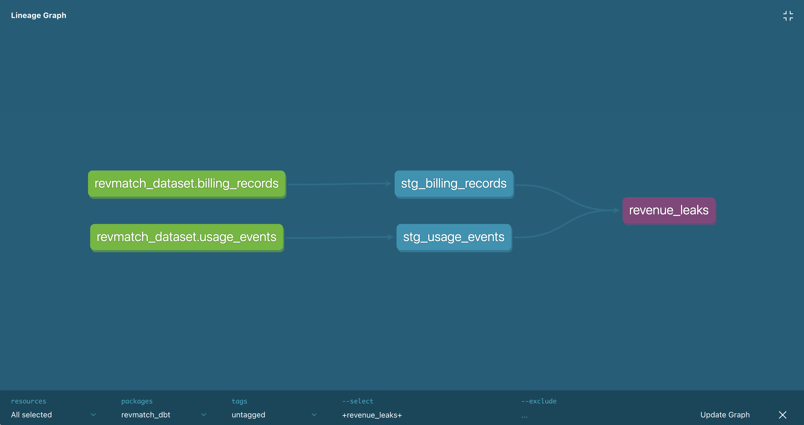

# RevMatch dbt Project

This **dbt project** powers the **transformation layer** of **RevMatch** – a production-grade data pipeline that detects revenue leaks in usage-based SaaS billing.

## How It Works

RevMatch uses **dbt** to transform **raw SaaS usage** and **billing data** into clean, analytics-ready models stored in **BigQuery**.

### **Data Flow**
1. **Raw Data → Seeds**
   - `usage_events.csv` and `billing_records.csv` are generated by the ingestion layer and loaded into BigQuery as **seed tables**.
   - Command:
     ```bash
     dbt seed
     ```

2. **Staging Models**
   - Standardize formats, clean column names, and apply type casting for consistency.
   - Models:
     - `stg_usage_events`
     - `stg_billing_records`

3. **Intermediate Models**
   - Aggregate and derive metrics for downstream analysis.
   - Example:
     - `daily_revenue.sql` → Summarizes usage & billing by date and tenant.

4. **Core Models**
   - Apply business logic to detect revenue leakage and compute tenant-level KPIs.
   - Models:
     - `metrics/revenue_leaks.sql` → Identifies underbilling/overbilling gaps.
     - `metrics/tenant_metrics.sql` → Aggregates financial & performance metrics per tenant.

### **Execution Order**
- dbt runs models in dependency order:
  ```
  seeds → staging → intermediate → core
  ```

## Data Lineage
Example lineage for the revenue leaks model:



## **Key Commands**
Run all models:
```bash
dbt run
```

Load seed data:
```bash
dbt seed
```

Test data integrity:
```bash
dbt test
```
